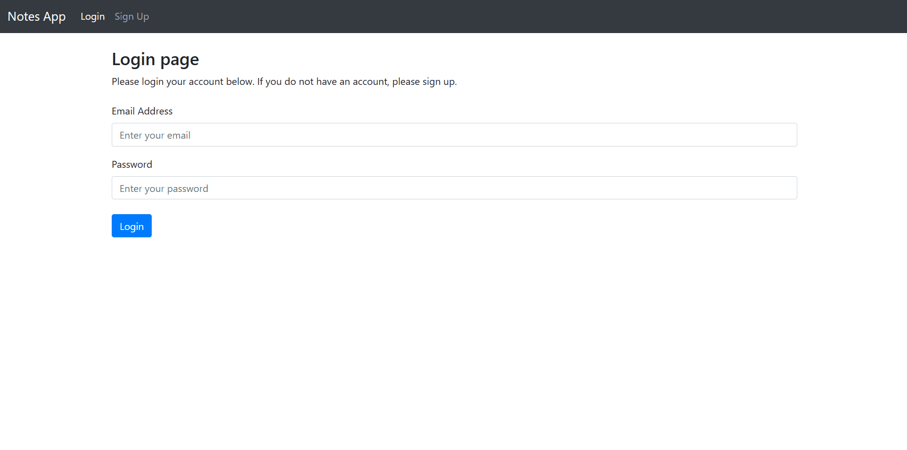

## Notes Web Application
---

### Website

Hosted using AWS EC2 instance using Apache2: (terminated)

http://ec2-43-207-32-222.ap-northeast-1.compute.amazonaws.com/login?next=%2F

### Demonstration



### Host using docker container

1. Build the docker image and run the container using the below command
    ```ps
    # direct to project directory
    docker build -t notes_app .
    docker run -d --name notes_app_1 -p 5001:5001 notes_app
    ```
2. Go to http://127.0.0.1:5001
